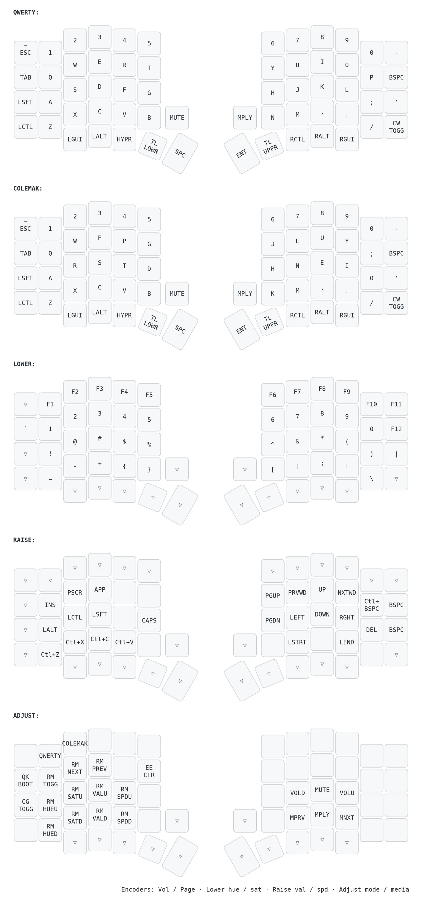

# Sofle Choc firmware

QMK [external userspace](https://docs.qmk.fm/newbs_external_userspace) for a
Sofle Choc v2.1: 2x Pro Micro (ATmega32U4), 2x SSD1306 128x32 OLED, 2x EC11
encoder with push, per-key SK6812 RGB.

Built against mainline `qmk/qmk_firmware` (`keyboards/sofle_choc`), which has
supported this board since brianlow's PR #16736 was merged — the official build
guide still tells you to clone the `choc2` fork branch, and that is out of date.

## Layers

The five layers from the build guide's default layout:

| Layer | Reached by | Contents |
|-------|-----------|----------|
| QWERTY | default | letters, number row, Grave Escape and `-` on the outer columns, `Mute` / `Play` on the encoder pushes, Caps Word on the right pinky |
| COLEMAK | `Colmak` on Adjust | alternate base layout, remembered across reboots |
| LOWER | left thumb | F1–F12, numbers, symbols, brackets |
| RAISE | right thumb | arrows, Home/End, word-wise motion, Ins/PrtSc/Menu, clipboard |
| ADJUST | LOWER + RAISE together | RGB controls, layout switch, Mac/Win swap, media, `QK_BOOT`, `EE_CLR` |

`MacWin` on the Adjust layer swaps Ctrl and GUI. The clipboard keys and word
motions follow that swap automatically.

## Pinky columns

The outer columns differ from the build guide's diagram:

```
left                          right
,------.                     ,------.
| Esc~ |  Grave Escape       |  -   |  minus / underscore
| Tab  |                     | Bspc |
|LShift|                     |  '   |
|LCtrl |                     |CapsWd|
`------'                     `------'
```

The top-left key is `QK_GESC`: tap it for **Escape**, `Shift`+tap for **~**,
`GUI`+tap for **`**. That frees the row below it, so Tab, Shift and Ctrl each
move up one and Ctrl lands on the bottom row — where the MX Sofle's diagram
puts Shift. Ctrl moved off the left thumb to make room for Hyper, so this is
now the only left-hand Ctrl.

A bare backtick with no modifier lives on LOWER, at the left pinky of the
number row.

The top-right key, a duplicate `` ` `` in the stock layout, is `-` / `_`.

## Hyper on the left thumb

The left thumb is `KC_HYPR` — Ctrl+Shift+Alt+GUI held together. It types
nothing on its own; the point is that no application binds all four modifiers
at once, so `Hyper`+anything is a private namespace of shortcuts that will
never collide with your editor, browser or terminal.

The bindings live in your window manager, not here. In sway or i3:

```
bindsym Ctrl+Shift+Alt+Mod4+t exec foot
bindsym Ctrl+Shift+Alt+Mod4+b exec firefox
```

If Mod4 is awkward because your compositor already owns it, `KC_MEH`
(Ctrl+Shift+Alt, no GUI) is the same idea without it.

Hyper is immune to the `MacWin` swap: Ctrl and GUI are both in the set, so
exchanging them changes nothing.

## Encoders

Both encoders are mapped per layer, so holding a thumb key changes what they
do. Counter-clockwise is the first action listed, clockwise the second.

| Layer | Left encoder | Right encoder |
|-------|--------------|---------------|
| QWERTY / COLEMAK | volume down / up | page down / up |
| LOWER | RGB hue − / + | RGB saturation − / + |
| RAISE | RGB brightness − / + | RGB speed − / + |
| ADJUST | RGB mode previous / next | media previous / next track |

Holding LOWER, RAISE or ADJUST therefore turns the two knobs into a full
lighting console: hue and saturation, brightness and speed, then the effect
itself — with the current values shown on the OLED while Adjust is held.

The encoder shafts are wired as keys: **left pushes Mute, right pushes
Play/Pause**. Those are set on the base layers and left transparent everywhere
else, so they do the same thing on every layer.

## Caps Word

The right pinky (where right shift normally sits) is `CW_TOGG`. Tap it and the
next word is capitalised — `MAX_BUFFER_SIZE` — and it switches itself off at
the first space, or after five idle seconds. The OLED shows `WORD` while it is
armed, in the same slot that shows `CAP` for caps lock.

There is no right shift as a result; shifting is the left pinky. If you want
it back, swap `CW_TOGG` for `KC_RSFT` on the two base layers and move Caps Word
somewhere else — a spare Adjust key, or `BOTH_SHIFTS_TURNS_ON_CAPS_WORD` in
`config.h` if you would rather chord both shifts for it.

## Per-key RGB as a layer legend

Hold LOWER, RAISE or ADJUST and the animation gives way to a legend: only the
keys that actually do something on that layer light up. Keys that are
transparent (they fall through to the base layer) and unused keys stay dark, so
what you see is exactly what the layer changes. Useful with blank keycaps.

Within a layer, keys are coloured by **what they do**, not where they sit:

| Colour | Keys |
|--------|------|
| white | the four arrow keys |
| teal | the rest of movement — the nav cluster, word- and line-wise motion |
| red | destructive — Backspace, Delete, Ctrl+Backspace, `QK_BOOT`, `EE_CLR` |
| green | clipboard, Caps Lock, and the layout / Mac-Win switches |
| blue | the function row |
| amber | digits |
| layer colour | everything else — cyan on Lower, magenta on Raise, amber on Adjust |

So Raise reads as a white arrow cluster picked out from teal page/word
motions, with a red delete group, all floating on magenta; and Lower as a blue
function row above amber digits. On Adjust the four
lighting controls take the colour of the thing they change: hue magenta,
saturation red, brightness white, speed blue.

Because the rules match on keycodes rather than positions, they keep working
when you rearrange a layer — move the arrows and they stay white, add an F-key
anywhere and it comes up blue. Categories live in one `switch` in
`rgb_matrix_indicators_advanced_user()`; the colours are `#define`s above it.

The base layers are left alone, so your chosen animation still runs there, and
`RM_TOGG` turns the legend off along with everything else.

## OLEDs

Both screens are driven, rotated 270° (5 characters wide, 16 lines):
keyboard name, active base layout, active layer, caps-lock, and — on the master
half only — `MAC`/`WIN` plus a live readout of RGB mode/hue/sat/val/speed while
you are holding Adjust.

If the right-hand screen reads upside down, flip `OLED_ROTATION_270` to
`OLED_ROTATION_90` in the non-master branch of `oled_init_user()`.

## Keymap diagram



`keymap.svg` (vector, crisp at any zoom) and `keymap.png` (1600px wide) are
rendered with [keymap-drawer](https://github.com/caksoylar/keymap-drawer) from
the real `keymap.c`, so they cannot drift from the firmware.

```sh
./draw.sh              # redraw from keymap.yaml
./draw.sh --reparse    # re-read keymap.c first (resets hand-made tweaks)
```

A `pre-commit` hook redraws them for you, so the diagram in this README can
never lag the firmware. Enable it once per clone:

```sh
git config core.hooksPath .githooks
```

It only fires when `keymap.c`, `keymap.yaml` or `draw.sh` is part of the
commit, and it refuses a commit that changes `keymap.c` without `keymap.yaml`
— the diagram is rendered from the yaml, so the two have to move together.
`git commit --no-verify` skips it.

`keymap.yaml` is the intermediate: `--reparse` regenerates it from the
firmware, which discards the layer names, the tidied `QWERTY`/`COLEMAK`
legends and the encoder footer, so re-apply those afterwards.

## Build and flash

The QMK CLI already points at this directory (`user.overlay_dir`), so from
anywhere:

```sh
qmk compile -kb sofle_choc -km quint     # -> sofle_choc_quint.hex here
qmk flash   -kb sofle_choc -km quint     # build + flash the attached half
```

Flash the **same** firmware to both halves, one at a time:

1. Unplug the TRRS cable — never hot-plug it.
2. Plug in the left half, run `qmk flash ...`, tap the reset button twice when
   the console asks (some Pro Micros need the double tap).
3. Unplug, plug in the right half, run the same command again.
4. Unplug, reconnect TRRS, plug USB into the **left** half.

Coming from other firmware (an MX Sofle build, say), clear the stored settings
once afterwards: hold LOWER + RAISE and press `EE_CLR` (the `T` position on the
left half). Otherwise stale RGB and layout state can persist.

## Flash budget

The ATmega32U4 has 28672 bytes of usable flash. Mainline's stock
`sofle_choc:default` — one layer, a logo on the OLED — already uses 91% of
it, because the board's `keyboard.json` enables all 29 RGB matrix animations.
This keymap disables all but five in `config.h` and lands at:

```
25394/28672 (88%, 3278 bytes free)
```

For reference: the RGB layer legend plus Caps Word (with its OLED readout)
cost 640 bytes, splitting the legend into per-keycode categories another 280,
and giving the arrows their own colour 22 more. Grave Escape and Hyper are
free — both were already compiled in.

Delete an `#undef ENABLE_RGB_MATRIX_*` line to get an animation back, or add
features into the remaining 4 KB. The build prints the size every time.

## Layout

```
keyboards/sofle_choc/keymaps/quint/
  keymap.c    layers, encoder map, OLED rendering
  config.h    tri-layer, split options, RGB trimming
  rules.mk    features
qmk.json      userspace manifest (build target sofle_choc:quint)
```
